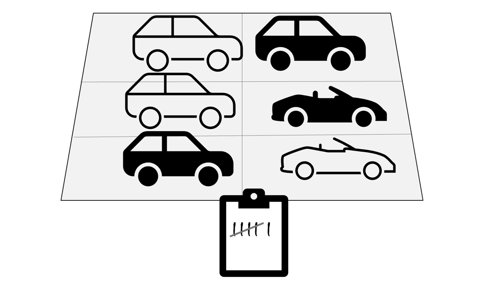

There are two general ways to process data:

- *Batch* data processing, in which multiple data records are collected and stored before being processed together in a single operation.
- *Stream* processing, in which a source of data is constantly monitored and processed in realtime as new data events occur.

For example, suppose you want to analyze road traffic by counting the number of cars on the road. A batch processing approach to this would require that you collect the cars in a parking lot, and then count them while in a single operation they're at rest.

If the road is buy, with a large number of cars driving along at frequent intervals, this approach may be impractical; and note that you don't get any results until you have collected all of the cars and counted them.

A better approach might be to apply a *stream* processing approach, by counting the cars in realtime as they pass:

In this approach, you don't need to wait until all of the cars have parked to start processing them, and you can aggregate the data over time intervals; for example, by counting the number of cars that pass each minute.